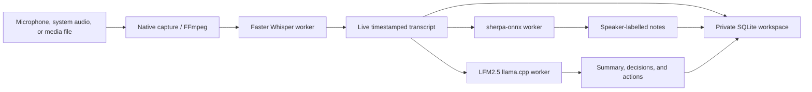

<div align="center">
  
  <h1>Meet2Notes</h1>
  <p><strong>Private, real-time AI meeting transcription, speaker diarization, and summaries.</strong></p>
  <p>Your conversations stay on your computer.</p>

  <p>
    
    
    
    
    
  </p>
</div>

Meet2Notes is a self-hosted, local-first meeting assistant for private meeting
notes. It captures microphones, audio interfaces, or desktop audio; shows a
live transcript; identifies speakers; and creates useful AI summaries without
sending recordings to a cloud service.

It combines [Faster Whisper](https://github.com/SYSTRAN/faster-whisper),
[sherpa-onnx](https://github.com/k2-fsa/sherpa-onnx), and
[LFM2.5 1.2B](https://huggingface.co/LiquidAI/LFM2.5-1.2B-Instruct-GGUF)
behind independent workers that can keep models resident in RAM or VRAM.

> Meet2Notes is in active alpha development. Back up important recordings and
> always obtain the consent required to record a conversation.

<details>
<summary><strong>Table of contents</strong></summary>

- [Why Meet2Notes](#why-meet2notes)
- [Install from zero](#install-from-zero)
- [Managed models](#managed-models)
- [How it works](#how-it-works)
- [Platform support](#platform-support)
- [Data, privacy, and migration](#data-privacy-and-migration)
- [Development](#development)
- [Roadmap](#roadmap)

</details>

## Why Meet2Notes

- **Private by default** — local server, local SQLite database, local models,
  no telemetry, and no automatic cloud upload.
- **Live transcription** — provisional timestamped text appears while the
  meeting is still being recorded, followed by a final quality pass.
- **OBS-style audio sources** — microphones, USB mixers, audio interfaces,
  Windows WASAPI loopback, and available Linux monitor inputs.
- **Speaker-aware notes** — local sherpa-onnx diarization labels who spoke when.
- **Local AI summaries** — LFM2.5 1.2B Q4_K_M produces overviews, key points,
  decisions, actions, and open questions through llama.cpp.
- **Professional model controls** — device, compute type, language, VAD,
  decoding, live window overlap, clustering, context, sampling, GPU layers,
  and memory residency are configurable.
- **Portable media import** — WAV, MP3, M4A, FLAC, OGG, AAC, MP4, MKV, WebM,
  and MOV through FFmpeg.

## Install from zero

The installer creates an isolated `.venv`, installs native audio and AI
runtimes, detects a compatible llama.cpp backend, installs FFmpeg when the
platform package manager permits it, downloads the recommended models, and
verifies the final environment.

### Windows 10/11

Install Git and Python 3.12, then clone and launch:

```powershell
winget install --id Git.Git --exact
winget install --id Python.Python.3.12 --exact

git clone https://github.com/estebanstifli/Meet2Notes.git
cd Meet2Notes
.\install.cmd -Start
```

`install.cmd` runs the readable PowerShell installer with a process-only policy
bypass. It does not install an unsigned application binary or weaken the
permanent PowerShell policy.

### macOS

```bash
brew install git python@3.12 ffmpeg portaudio
git clone https://github.com/estebanstifli/Meet2Notes.git
cd Meet2Notes
chmod +x install.sh
./install.sh --start
```

### Ubuntu/Debian

```bash
sudo apt update
sudo apt install -y git python3 python3-venv python3-dev \
  ffmpeg portaudio19-dev libsndfile1 build-essential cmake

git clone https://github.com/estebanstifli/Meet2Notes.git
cd Meet2Notes
chmod +x install.sh
./install.sh --start
```

Meet2Notes opens at [http://127.0.0.1:8765](http://127.0.0.1:8765). It binds
only to the local machine unless you explicitly change the host.

See the complete [installation guide](docs/INSTALLATION.md) for Fedora, Arch,
private-repository authentication, CUDA/Metal selection, upgrades, existing
dependencies, and troubleshooting.

## Managed models

The default installation downloads and validates these local models:

| Purpose | Default | Approx. download | Runtime |
|---|---|---:|---|
| Speech-to-text | Faster Whisper `small` | 464 MiB | CTranslate2, CPU/CUDA |
| Speaker diarization | Pyannote 3.0 int8 + 3D-Speaker | 45 MiB | sherpa-onnx |
| Meeting summaries | LFM2.5 1.2B Q4_K_M | 700 MiB | llama.cpp |

Model weights are **not committed to this repository**. Faster Whisper and
LFM2.5 come directly from their publishers on Hugging Face; the two
sherpa-onnx models come from official k2-fsa GitHub Releases. They are stored in
the operating system's private Meet2Notes data directory and reused on later
runs.

You can install or verify them independently:

```bash
meet2notes-models --models all
meet2notes-models --models whisper --whisper-model medium
meet2notes-models --models diarization summary
```

Downloads happen only when you run the installer, invoke `meet2notes-models`, or
confirm an installation action in Settings.

Re-running an installer is safe: it reuses `.venv`, compatible packages,
FFmpeg/FFprobe found on `PATH`, existing models, databases, and recordings. Use
the explicit `-ReinstallAiRuntime` or `--reinstall-ai-runtime` option only when
replacing an existing CPU/GPU llama.cpp backend.

## How it works



Each AI engine owns a dedicated executor. Inference never runs on FastAPI's event
loop, and each model can be loaded or unloaded independently. Live transcription
uses short overlapping windows; the browser reads lightweight session state and
fetches transcript changes as soon as new segments are persisted.

See [Architecture](docs/architecture.md) and [Privacy](docs/privacy.md) for the
full design.

## Platform support

| Capability | Windows | macOS | Linux |
|---|---|---|---|
| Microphone/audio interface | WASAPI | CoreAudio | PipeWire/Pulse/ALSA |
| Desktop audio | WASAPI loopback | Virtual/tap-backed input* | Monitor input* |
| Faster Whisper CPU | Yes | Yes | Yes |
| Faster Whisper CUDA | NVIDIA | — | NVIDIA |
| llama.cpp acceleration | CUDA | Metal | CUDA or CPU |

\* Availability depends on the audio source exposed by the host system.

For the easiest accelerated installation, Python 3.12 is preferred. Current
prebuilt `llama-cpp-python` CUDA wheels support Python 3.10–3.12; the installer
uses a portable CPU wheel when an accelerated wheel is not compatible.

## Manual installation

```bash
python -m venv .venv
# Windows: .\.venv\Scripts\Activate.ps1
# macOS/Linux: source .venv/bin/activate
python -m pip install --upgrade pip
python -m pip install -e ".[capture,transcription,diarization]"
python -m pip install "huggingface-hub>=0.27,<2"
python -m pip install "llama-cpp-python>=0.3.8,<1" \
  --extra-index-url https://abetlen.github.io/llama-cpp-python/whl/cpu
meet2notes-models --models all
meet2notes
```

Alternative startup:

```bash
python -m local_meeting_ai --no-browser
```

Run `meet2notes --help` for host, port, data directory, FFmpeg, browser, and
logging options.

## Data, privacy, and migration

New installations store data under the platform-standard `Meet2Notes` user data
directory. Existing LocalMeet2Resume installations continue using their original
directory automatically, preserving databases, models, and absolute recording
paths. Set `M2N_DATA_DIR` or pass `--data-dir` to choose a different location.

API keys are never stored by the app. An optional remote OpenAI-compatible
summary provider reads its key from the environment variable selected in
Settings (default: `MEET2NOTES_AI_API_KEY`).

## Development

```bash
.\install.ps1 -Dev -Models none       # Windows
./install.sh --dev --no-models        # macOS/Linux

ruff check .
mypy src
pytest
```

The repository includes multi-platform GitHub Actions checks for Python 3.11 and
3.13. Please read [CONTRIBUTING.md](CONTRIBUTING.md) before submitting changes.

## Roadmap

Next priorities include Markdown/TXT/JSON/SRT/VTT exports, editable speaker
identities, native macOS system-audio capture, additional transcription and
summary providers, and signed desktop installers. See the
[detailed roadmap](docs/roadmap.md).

## License

Meet2Notes is released under the [MIT License](LICENSE).
